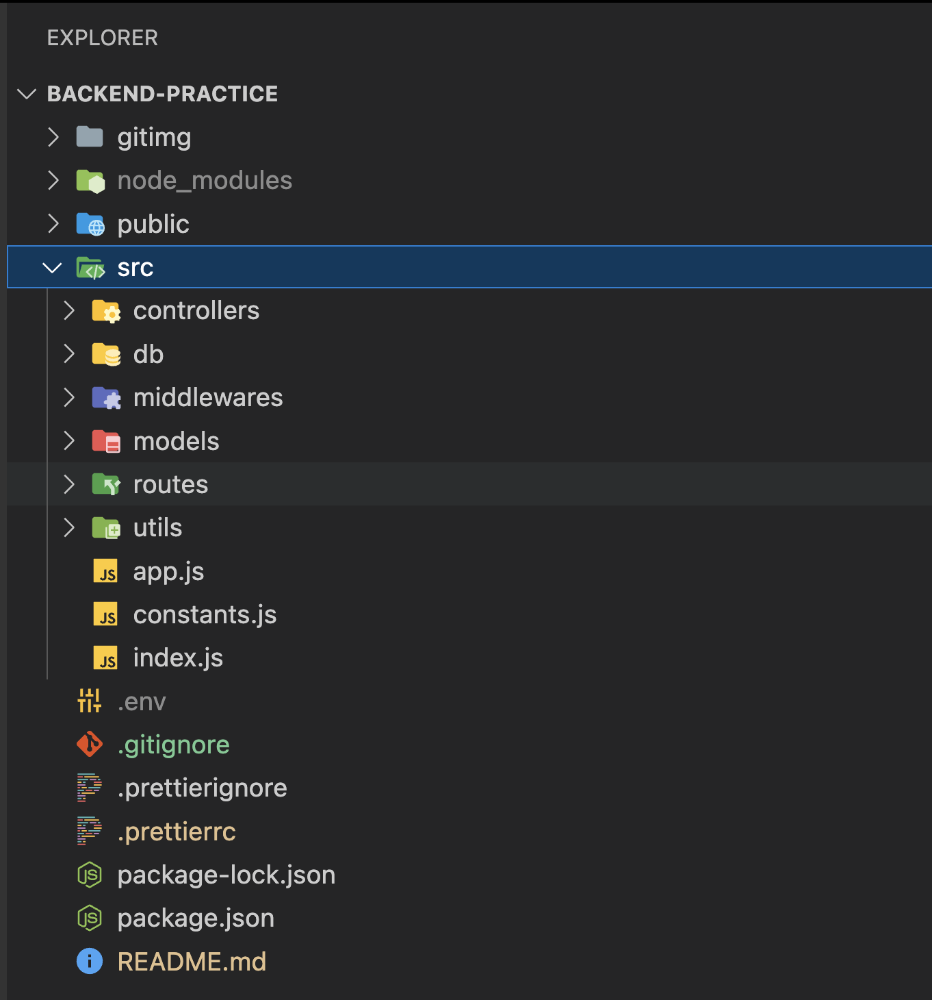

# Step 1 
### Project Setup
```
project-name/
├── src/
│   ├── controllers
│   ├── db
|   ├── middlewares
│   ├── models
|   ├── routes
|   ├── utils
|   ├── app.js
|   ├── constants.js
|   ├── index.js
│   └──  
├── public/
│   ├──temp
|      ├── 
|      └── ...
├── .gitgnore
├── .prettierignore
├── .prettierrc
├── node_modules/
├── package.json
├── package-lock.json
├── README.md
└── ...
```
 


This looks like a typical folder structure for a Node.js project. Let me break it down for you:

1. **src/:** This is the main source code directory, where you'll find the actual code for your application.

   - **controllers:** This folder likely contains modules or files that handle the application's business logic.
   - **db:** It probably holds database-related code, like database connection setup or schema definitions.
   - **middlewares:** This could include custom middleware functions for your Express.js application.
   - **models:** This is where you'd define your data models if you're using an ORM (Object-Relational Mapping) or similar.
   - **routes:** Here, you'd define the routes for your application using something like Express.js.
   - **utils:** This might contain utility functions or helper modules used across different parts of your application.
   - **app.js:** The entry point of your application. It's where your application is initialized, and often where the main server setup is done.
   - **constants.js:** This could store constants or configuration settings used throughout the application.
   - **index.js:** Another common entry point or a file that exports the main functionality of your application.

2. **public/:** This directory is typically meant for static assets that can be served directly by your web server.

   - **temp/:** It seems like a temporary directory, perhaps for storing temporary files during the operation of your application.

3. **.gitignore:** This file specifies intentionally untracked files that Git should ignore.

4. **.prettierignore:** Prettier is a code formatter. This file lists files or directories that Prettier should ignore.

5. **.prettierrc:** This file contains configuration options for Prettier.

6. **node_modules/:** This is where npm installs the project dependencies.

7. **package.json:** This file holds metadata about the project and its dependencies, as well as scripts to run various tasks.

8. **package-lock.json:** This file is automatically generated for any operations where npm modifies either the node_modules tree or package.json.

9. **README.md:** A documentation file that provides information about your project.

The structure follows common conventions for Node.js projects, especially those using frameworks like Express.js.

# Step 2 
### How to connect database in MERN with debugging

<table>
<tr>
<th>Explanation</th>
<th>Code</th>
</tr>
<tr>
<td>
<pre>
A connection method is typically used to establish a connection between your application and a database. It allows your application to interact with the database by sending queries, retrieving data, and performing other database operations.
</pre>
</td>
<td>

```
import mongoose from "mongoose";
import { DB_NAME } from "../constants.js"
const connectDB = async ()=>{
    try{
        const connectionInstance = await mongoose.connect(`${process.env.MONGOGB_URI}/${DB_NAME}`);
        console.log(` MongoDB connected !! DB HOST: ${connectionInstance.connection.host}`);
    }
    catch(error){
        console.log(error)
        process.exit(1);
    }
}
export default connectDB;
```

</td>
</tr>
</table>


1. here's a brief point-by-point explanation of the code:

2. mongoose, a MongoDB object modeling tool, is imported.

3. DB_NAME is imported from a constants file.

4. An asynchronous function connectDB is declared.

5. Inside connectDB, a try block is used to attempt a connection to the MongoDB database.

6. The connection string is formed using an environment variable MONGOGB_URI and DB_NAME.

7. If the connection is successful, a message is logged to the console with the host of the database.

8. If an error occurs during the connection, it is caught in the catch block.

9. The error is logged to the console and the process is exited with a failure code (1).

10. The connectDB function is exported for use in other parts of the application.

